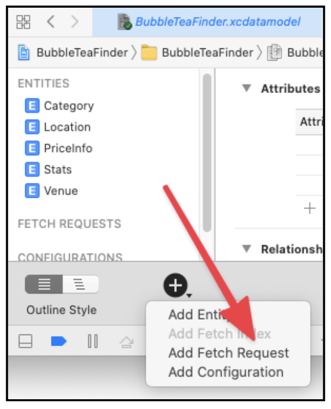
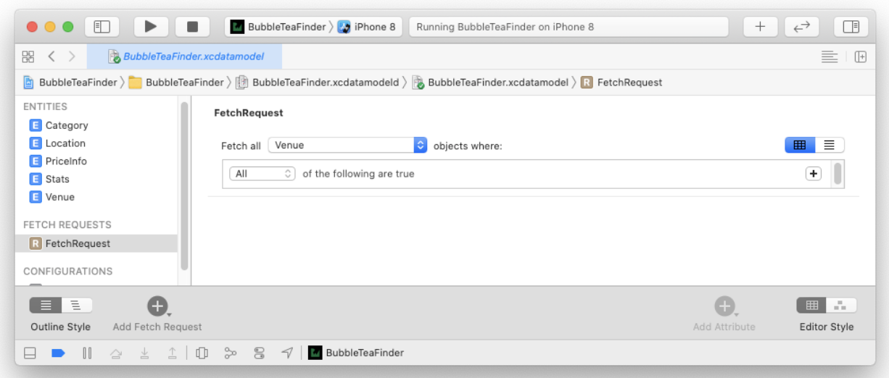

# NSFetchRequest

通过创建 `NSFetchRequest` 实例，根据需要对其进行配置并将其移交给 `NSManagedObjectContext` 来完成繁重的工作，从 `Core Data` 中获取记录。

看起来很简单，但实际上有五种不同的方法来获取 `fetch` 请求。有些比其他的更受欢迎，但作为 `Core Data` 开发人员，您可能会在某个时候遇到所有这些。

以下是设置 `fetch` 请求的五种不同方法：

```
// 1
let fetchRequest1 = NSFetchRequest<Venue>()
let entity = NSEntityDescription.entity(forEntityName: "Venue", in: managedContext)!

// 2                         
let fetchRequest2 = NSFetchRequest<Venue>(entityName: "Venue")
fetchRequest1.entity = entity

// 3
let fetchRequest3: NSFetchRequest<Venue> = Venue.fetchRequest()

// 4
let fetchRequest4 = managedObjectModel.fetchRequestTemplate(forName: "venueFR")
  
// 5
let fetchRequest5 = managedObjectModel.fetchRequestFromTemplate(withName: "venueFR", substitutionVariables: ["NAME" : "Vivi Bubble Tea"])
```

1. 将 `NSFetchRequest` 的实例初始化为泛型类型：`NSFetchRequest<Venue>`。至少必须为读取请求指定 `NSEntityDescription`。在本例中，实体为 `Venue`。初始化 `NSEntityDescription`的实例，并使用它来设置读取请求的实体属性。
2. 这里你使用`NSFetchRequest`的方便初始化器。它在一个步骤中初始化了一个新的获取请求并设置其实体属性。你只需要为实体名称提供一个字符串，而不是一个完整的`NSEntityDescription`。
3. 正如第二个例子是第一个的缩写，第三个例子是第二个的缩写。当您生成`NSManagedObject`子类时，此步骤还会生成一个`class`方法，该方法返回一个已经设置好的`NSFetchRequest`，以获取相应的实体类型。这就是`Venue.fetchRequest()`的由来。这个代码存在于`Venue+CoreDataProperties.swift`中。
4. 在第四个例子中，你从你的`NSManagedObjectModel`中检索你的`fetch`请求。你可以在`Xcode`的数据模型编辑器中配置和存储常用的`fetch`请求。
5. 最后一种情况与第四种情况类似。从你的托管对象模型中获取一个获取请求，但是这一次，你传入了一些额外的变量。这些 "替换 "变量被用在一个谓词中，以完善你的获取的结果。

<!---->

还可以在数据模型中直接存储经常使用的 fetch request

在数据模型的文件中，长按下图中的➕，在弹出框中选择 **Add Fetch Request**



然后会在左边的 **FETCH REQUESTS** 下面看到创建的请求，右边是请求的详细内容，可以选择获取哪个 model 的数据，在下面还可以添加数据获取条件，来获取不同的数据。



在代码中获取这个新创建的 fetch request

首先创建两个属性：

```
var fetchRequest: NSFetchRequest<Venue>?
var venues: [Venue] = []
```

接下来在 `viewDidLoad()` 中添加下面的代码：

```
guard let model = coreDataStack.managedContext.persistentStoreCoordinator?.managedObjectModel,
      let fetchRequest = model.fetchRequestTemplate(forName: "FetchRequest") as? NSFetchRequest<Venue> else {
  return
}
    
self.fetchRequest = fetchRequest
fetchAndReload()
```

这样做可以将你刚刚设置的`fetchRequest`属性与你使用`Xcode`的数据模型编辑器创建的属性连接起来。这里有三件事要记住：

1. 与其他获取获取请求的方式不同，这个方式涉及到托管对象模型。这就是为什么你必须通过`coreDataStack`属性来获取你的获取请求。
2. 自定义的`CoreDataStack`，所以只有托管上下文是公开的。为了检索托管对象模型，你必须通过托管上下文的持久化存储协调器。
3. `NSManagedObjectModel`的`fetchRequestTemplate(forName:)`需要一个字符串标识符。这个标识符必须与你在模型编辑器中为你的获取请求选择的名称完全匹配。否则，你的应用程序将抛出一个异常并崩溃。

> 注意：你应该在什么时候在你的数据模型中存储`NSFetchRequest`？
如果你知道你会在你的应用程序的不同部分反复进行相同的`fetch`，你可以使用这个功能来节省你多次编写相同的代码。存储`NSFetchRequest`的一个缺点是，没有办法为结果指定一个排序顺序。因此，你看到的场地列表可能与书上的顺序不同。还有一个缺点：在数据模型中定义的`fetchRequest`是不可变的。

# Fetching different result types

`NSFetchRequest<ResultType>`中的`ResultType`遵循`NSFetchRequestResult`协议，遵循这个协议的类型有四个：

* `.managedObjectResultType`：返回被管理的对象（默认值）。
* `.countResultType`：返回与获取请求相匹配的对象的数量。
* `.dictionaryResultType`：这是一个万能的（catch-all）返回类型，用于返回不同的计算结果。
* `.managedObjectIDResultType`：返回唯一的标识符，而不是成熟的托管对象。

# Returning a count

获取数据源中某些条件下的数据数量

创建谓词`NSPredicate`来满足条件：

```
lazy var cheapVenuePredicate: NSPredicate = {
  NSPredicate(format: "%K == %@", #keyPath(Venue.priceInfo.priceCategory), "$")
}()
```

新建一个方法来实现获取满足条件的数据：

```
func populateCheapVenueCountLabel() {
  let fetchRequest = NSFetchRequest<NSNumber>(entityName: "Venue")
  fetchRequest.resultType = .countResultType
  fetchRequest.predicate = cheapVenuePredicate
  
  do {
    let countResult = try coreDataStack.managedContext.fetch(fetchRequest)
    
    let count = countResult.first?.intValue ?? 0
    let pluralized = count == 1 ? "place" : "places"
    firstPriceCategoryLabel.text = "\(count) bubble tea \(pluralized)"
  } catch let error as NSError {
    print("count not fetched \(error), \(error.userInfo)")
  }
}
```

将`fetchRequest.resultType`设置为`countResultType`，并且`fetchRequest.predicate`设置为创建的谓词`cheapVenuePredicate`

注意，为了能正常工作，`NSFetchRequest`的类型参数必须为`NSNumber`，而不是 Venue。当把`fetchRequest.resultType`设置为`countResultType`时，返回值会变成一个包含单个`NSNumber`的swift 数组。`NSNumber`里面的整数就是你要找的总计数。

# An alternate way to fetch a count 另外一种获取数量的方法

```
func populateExpensiveVenueCountLabel() {
  let fetchRequest = Venue.fetchRequest()
  fetchRequest.predicate = expensiveVenuePredicate
  
  do {
    let count = try coreDataStack.managedContext.count(for: fetchRequest)
    let pluralized = count == 1 ? "place" : "places"
    thirdPriceCategoryLabel.text = "\(count) bubble tea \(pluralized)"
  } catch let error as NSError {
    print("count not fetched \(error), \(error.userInfo)")
  }
}
```

在上面的代码片段中，通过模型的`fetchRequest()`方法获取`fetchRequest`，不用设置`fetchRequest`的返回类型，也没有使用`fetch(_:)`，而是使用`NSManagedObjectContext`的`count(for:)`方法。

`count(for:)`的返回值是一个整数，你可以直接用它。

# Performing calculations with fetch requests

有时候需要计算满足某些条件的数据总数，例如，你的模型中有一个是否最爱的属性（Bool），需要计算最爱的数据的总数。`Core Data`内置了一些不同的函数支持，如平均、总和、最大和最小。

```
func populateDealsCountLabel() {
//  1
  let fetchRequest = NSFetchRequest<NSDictionary>(entityName: "Venue")
  fetchRequest.resultType = .dictionaryResultType
  
//  2
  let sumExpressionDesc = NSExpressionDescription()
  sumExpressionDesc.name = "sumDeals"
  
//  3
  let specialCountExp = NSExpression(forKeyPath: #keyPath(Venue.specialCount))
  sumExpressionDesc.expression = NSExpression(forFunction: "sum:", arguments: [specialCountExp])
  sumExpressionDesc.expressionResultType = .integer32AttributeType
//  4
  fetchRequest.propertiesToFetch = [sumExpressionDesc]
  
//  5
  do {
    let results = try coreDataStack.managedContext.fetch(fetchRequest)
    
    let resultDict = results.first
    let numDeals = resultDict?["sumDeals"] as? Int ?? 0
    let pluralized = numDeals == 1 ? "deal" : "deals"
    numDealsLabel.text = "\(numDeals) \(pluralized)"
  } catch let error as NSError {
    print("count not fetched \(error), \(error.userInfo)")
  }
}
```

1. 首先获取到`fetchRequest`，然后将`fetchRequest.resultType`设置为`dictionaryResultType`。
2. 创建一个`NSExpressionDescription`来进行求和，并将`name`属性设置为`sumDeals`，这样就可以从`fetch`中得到的字典中读出它的结果。
3. 用需要进行求和的属性创建一个`NSExpression` -- `specialCountExp`，然后为`sumExpressionDesc.expression`进行赋值，`sum:`作为第一个参数，`specialCountExp`作为作为第二个参数。最后，你必须设置`sumExpressionDesc.expressionResultType`，所以你把它设置为`integer32AttributeType`。
4. 通过将`propertiesToFetch`属性设置为您刚刚创建的`NSExpressionDescription`，您可以告诉您的原始`fetch`请求获取总和。
5. 最后，在通常的`do-catch`语句中执行`fetch`请求。结果类型是一个`NSDictionary`数组，所以你用你的表达式描述的名字（`sumDeals`）来检索你的表达式的结果。

`init(forFunction name: String, 
arguments parameters: [Any])`的`name`属性参考下面的链接：

[init(forFunction:arguments:) | Apple Developer Documentation](https://developer.apple.com/documentation/foundation/nsexpression/1413747-init)

`managedObjectIDResultType`这个现在已经不常用。

###### 使用谓词（`NSPredicate`）将数据分段加载

通过设置 `fetchRequest.predicate` 来对数据进行分段加载。

# Sorting fetched results 对获取的结果进行排序

使用`NSSortDescriptor`来对获取到的结果进行排序，排序发生在`SQLite`，而不是在内存中，这使得`Core Data`中的排序变的快速而高效。

```
let compareSelector = #selector(NSString.localizedStandardCompare(_:))
NSSortDescriptor(key: #keyPath(Venue.name), ascending: true, selector: compareSelector)

NSSortDescriptor(key: #keyPath(Venue.location.distance), ascending: true)
```

要初始化一个`NSSortDescriptor`的实例，你需要三样东西：一个指定你要排序的属性的`keyPath`，一个关于排序是升序还是降序的说明，以及一个执行比较操作的可选选择器。

# Asynchronous fetching 异步获取

用`NSAsynchronousFetchRequest`创建一个可选属性

```
var asyncFetchRequest: NSAsynchronousFetchRequest<Venue>?
```

注意，它跟`NSFetchRequest`没有直接的关系，它是`NSPersistentStoreRequest`的一个子类。当然`NSFetchRequest`也是`NSPersistentStoreRequest`的子类。

```
// 1
let venueFetchRequet: NSFetchRequest<Venue> = Venue.fetchRequest()
fetchRequest = venueFetchRequet

// 2
asyncFetchRequest = NSAsynchronousFetchRequest<Venue>(fetchRequest: venueFetchRequet, completionBlock: { [unowned self] result in
  guard let venues = result.finalResult else {
    return
  }

  self.venues = venues
  self.tableView.reloadData()
})

// 3
do {
  guard let asyncFetchRequest = asyncFetchRequest else {
    return
  }
  try coreDataStack.managedContext.execute(asyncFetchRequest)
  //  Returns immediately, cancel here if you want
} catch let error as NSError {
  print("Could not fetch \(error), \(error.userInfo)")
}
```

1. 异步获取请求并不取代常规的获取请求。相反，你可以把异步获取请求看作是对已经有的获取请求的一个包装。
2. 要创建一个`NSAsynchronousFetchRequest`，你需要两样东西：一个普通的`NSFetchRequest`和一个`completion handler`。你获取的场地包含在`NSAsynchronousFetchResult`的`finalResult`属性中。在完成处理程序中，你更新 `venues` 属性并重新加载表视图。
3. 指定完成处理程序是不够的! 你仍然需要执行异步获取请求。再一次，`CoreDataStack`的`managedContext`属性为你处理了繁重的工作。然而，注意你使用的方法是不同的--这次是`execute(_:)`而不是通常的`fetch(_:)`。`execute(_:)`立即返回。你不需要对返回值做任何处理，因为你要从完成块中更新表视图。返回类型是`NSAsynchronousFetchResult`。

最后，你可以用`NSAsynchronousFetchResult`的`cancel()`方法取消获取请求。

# Batch updates: no fetching required

从 iOS 8 开始，有新的方法来更新 `Core Data`的对象，而不需要将任何东西取到内存中：批处理更新（batch updates）。这项新技术大大减少了进行那些巨大的更新所需的时间和内存。

这个新技术绕过了`NSManagedObjectContext`，直接进入持久化存储。批量更新的经典用例是消息应用程序或电子邮件客户端中的 "将所有标记为已读 "功能。

```
let batchUpdate = NSBatchUpdateRequest(entityName: "Venue")
batchUpdate.propertiesToUpdate = [#keyPath(Venue.favorite): true]

batchUpdate.affectedStores = coreDataStack.managedContext.persistentStoreCoordinator?.persistentStores

batchUpdate.resultType = .updatedObjectsCountResultType

do {
  let batchResult = try coreDataStack.managedContext.execute(batchUpdate) as? NSBatchUpdateResult
  print("Records updated \(String(describing: batchResult?.result))")
} catch let error as NSError {
  print("Could not update \(error), \(error.userInfo)")
}
```

创建了一个`NSBatchUpdateRequest`实例，其中包含你想要更新的实体。接着，通过将`propertiesToUpdate`设置为一个字典来设置批量更新的请求，该字典包含要更新的属性`favorite`及其新值`true`的关键路径。然后，将`affectedStores`设置为持久性存储协调器的`persistentStores`数组。 最后，将结果类型设置为`updatedObjectsCountResultType`并执行批量更新请求。

#### NSBatchDeleteRequest 批量删除

顾名思义，批量删除请求可以一次高效地删除大量核心数据对象。 与`NSBatchUpdateRequest`一样，`NSBatchDeleteRequest`也是`NSPersistentStoreRequest`的子类。这两种类型的批处理请求行为相似，因为它们都直接在持久性存储上操作。

# Key Points

* `NSFetchRequest`是泛型类型。它接受一个类型参数，该参数指定您希望作为获取请求的结果获得的对象的类型。

* 如果您希望在应用程序的不同部分重用相同类型的获取，请考虑使用数据模型编辑器将不可变的获取请求直接存储在您的数据模型中。

* 使用`NSFetchRequest`的计数结果类型有效地计算并从`SQLite`返回计数。

* 使用`NSFetchRequest`的字典结果类型从`SQLite`中高效地计算并返回平均值、总和以及其他常见计算。

* 获取请求使用不同的技术，例如使用批量大小、批量限制和出错来限制返回的信息量。

* 为您的获取请求添加排序描述，以便有效地对获取的结果进行排序。

* 获取大量信息会阻塞主线程。使用`NSAsynchronousFetchRequest`将部分工作卸载到后台线程。

* `NSBatchUpdateRequest`和`NSBatchDeleteRequest`减少了更新或删除`Core Data`中大量记录所需的时间和内存。


